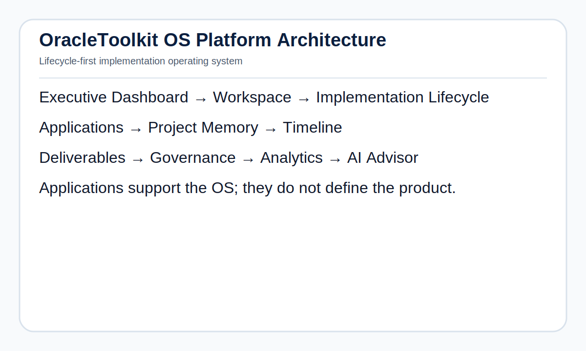

# OracleToolkit OS v1.0 — Architecture Index

## Executive Summary

OracleToolkit OS is a lifecycle-first Oracle Cloud implementation platform. It exists to run implementations, not merely launch tools.

The platform connects implementation phases, decisions, deliverables, risks, activities, applications, and evidence into one governed project memory.

## Architecture Principles

1. **Lifecycle First** — The implementation lifecycle is the center of the platform.
2. **Memory by Default** — Meaningful work should create or update Project Memory.
3. **Timeline Aware** — Significant implementation events should become Timeline Events.
4. **Governance Native** — Decisions, risks, gates, owners, and evidence are first-class objects.
5. **Applications Optional** — Applications accelerate work but are not the product.
6. **Evidence Ready** — Completion requires owner, status, timestamp, and evidence.
7. **Backward Compatible** — OS capabilities extend the stable v2.3.x platform.

## Platform Architecture



Editable Mermaid source: [`docs/diagrams/architecture.mmd`](docs/diagrams/architecture.mmd)

```text
OracleToolkit
│
├── Executive Dashboard
├── Workspace
├── Implementation Lifecycle
│   ├── Mobilization
│   ├── Common Design
│   ├── Discovery
│   ├── Sprint 1
│   ├── Sprint 2
│   ├── SIT
│   ├── UAT
│   ├── Deployment
│   └── Hypercare
│
├── Applications
│   ├── Discovery
│   ├── COA
│   ├── BCEA
│   ├── SOW
│   ├── Scenario
│   ├── Enterprise Structure
│   ├── Configuration
│   └── Future Applications
│
├── Project Memory
├── Timeline
├── Deliverables
├── Governance
├── Analytics
└── AI Advisor
```

## Layer Responsibilities

| Layer | Responsibility | Primary Users |
|---|---|---|
| Executive Dashboard | Implementation health, readiness, go-live confidence, risks | Executives, sponsors, PMO |
| Workspace | Project cockpit and working context | All users |
| Implementation Lifecycle | Phase-by-phase implementation engine | PMs, solution architects, leads |
| Applications | Specialist engines that write back to Project Memory | Consultants, architects, leads |
| Project Memory | Connected project knowledge store | All users |
| Timeline | Chronological implementation audit trail | PMs, architects, auditors |
| Deliverables | Versioned implementation artifacts | Consultants, PMs, clients |
| Governance | RAID, decisions, approvals, dependencies | PMO, PMs, architects |
| Analytics | Role-based implementation intelligence | Leadership, PMs, leads |
| AI Advisor | Context-aware recommendations and impact analysis | All roles |

## Core Data Flow

```text
User Action
↓
Workspace / Lifecycle / Application
↓
Project Memory
↓
Deliverable + Detailed Memory
↓
Timeline Event
↓
Governance / Analytics / AI Advisor
```

## System Boundary

OracleToolkit OS owns implementation lifecycle, project memory, governance, deliverables, timeline, analytics, and implementation intelligence.

OracleToolkit OS does not replace Oracle Fusion Cloud, all project management tools, or the client document repository.

## Specification Index

| Specification | Purpose |
|---|---|
| [`01-product-vision.md`](docs/01-product-vision.md) | Product direction, personas, positioning |
| [`02-platform-architecture.md`](docs/02-platform-architecture.md) | Platform layers and responsibilities |
| [`03-navigation-model.md`](docs/03-navigation-model.md) | User navigation and workspace model |
| [`terminology.md`](assets/terminology.md) | Controlled terminology |
| [`glossary.md`](assets/glossary.md) | Definitions |

## Acceptance Criteria for Architecture Compliance

A new feature is architecture-compliant only if:

- It maps to a lifecycle phase, governance object, dashboard, memory object, or platform service.
- It does not bypass Project Memory where persistent knowledge is required.
- It preserves existing workspace, authentication, and project context behavior.
- It has a clear primary persona.
- It has defined inputs, outputs, status, ownership, and evidence where applicable.
