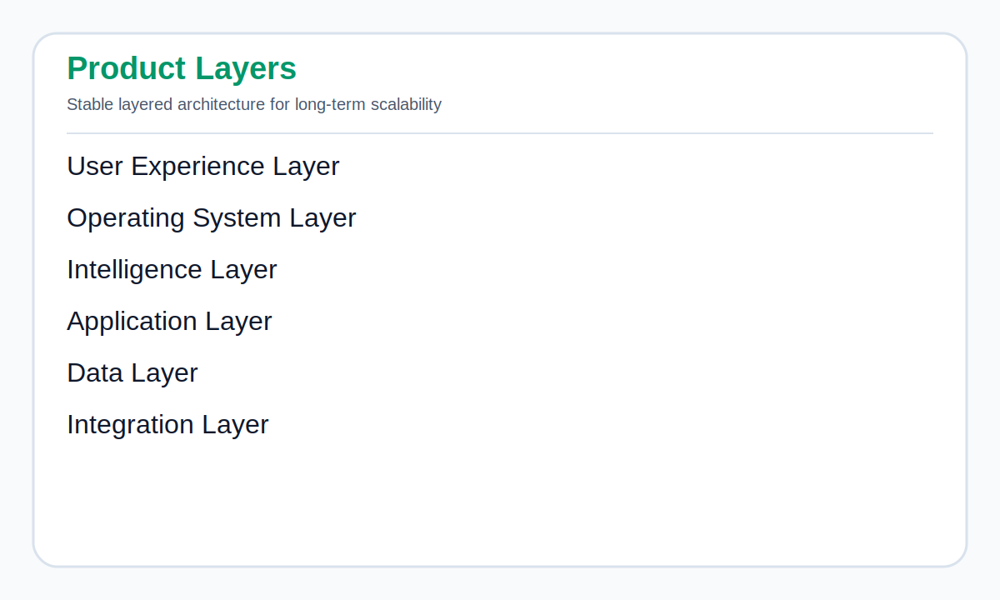

# 02 — Platform Architecture PRS

## Document Control

| Field | Value |
|---|---|
| Product | OracleToolkit OS |
| Specification | Platform Architecture |
| Version | v1.0 Pack 1 |
| Status | Approved Foundation |

## Executive Summary

OracleToolkit OS is a layered platform. The lifecycle engine governs implementation progress. Applications generate structured outputs. Project Memory stores knowledge. Timeline records history. Governance manages control. Analytics and AI reason over the connected implementation record.

## Product Layers

Editable Mermaid source: [`diagrams/product-layers.mmd`](diagrams/product-layers.mmd)

| Layer | Purpose |
|---|---|
| User Experience Layer | Dashboards, Workspace, Lifecycle, Applications |
| Operating System Layer | Phase engine, gate engine, governance engine |
| Intelligence Layer | Project Memory, Timeline, Analytics, AI Advisor |
| Application Layer | Discovery, COA, BCEA, SOW, Scenario, Configuration |
| Data Layer | Supabase tables, Clerk identity, payloads, evidence |
| Integration Layer | Streamlit apps, future APIs, import/export adapters |

## Architecture Diagram

Editable Mermaid source: [`diagrams/architecture.mmd`](diagrams/architecture.mmd)

## Core Components

### Executive Dashboard

Leadership-level summary of implementation health, current phase, open risks, gate status, readiness, and go-live confidence.

### Workspace

The project cockpit containing current project context, phase status, applications, deliverables, memory, governance, and timeline.

### Implementation Lifecycle

The heart of the OS. Phases include Mobilization, Common Design, Discovery, Sprint 1, Sprint 2, SIT, UAT, Deployment, and Hypercare.

### Applications

Applications are optional services that accelerate work and write outputs back to Project Memory.

### Project Memory

The project knowledge backbone. It stores decisions, assumptions, risks, RICE objects, configuration choices, testing evidence, cutover records, deliverables, and lessons learned.

### Timeline

The audit history of the implementation. Every important event should be represented as a timeline event.

### Governance

Controls RAID, decisions, dependencies, changes, approvals, escalations, and gate readiness.

### Analytics

Provides role-based dashboards and readiness scores.

### AI Advisor

Provides implementation-aware guidance by reasoning over Project Memory, Timeline, Governance, Deliverables, and lifecycle state.

## Data Ownership Rules

- Project identity is owned by Workspace.
- User identity is owned by Clerk.
- Persistent implementation knowledge is owned by Project Memory.
- Applications own generation logic but not long-term knowledge.
- Deliverables own versioned output payloads.
- Timeline owns event history.
- Governance owns risks, decisions, issues, assumptions, dependencies, and changes.

## Application Integration Rule

Applications must not become silos.

Every integrated application must support project context in, user identity in, deliverable out, memory rows out, phase mapping, and future timeline event creation.

## Security Boundary

OracleToolkit OS should avoid collecting sensitive production data by default. Upload workflows must be designed with clear restrictions and sanitization expectations.

## Non-Functional Requirements

| Requirement | Standard |
|---|---|
| Stability | Existing Workspace, auth, and saves must not break |
| Scalability | Architecture must support 10+ applications and multiple project phases |
| Traceability | Important records must link to project, user, phase, and timestamp |
| Extensibility | New applications should use the same integration contract |
| Auditability | Decisions, gates, evidence, and timeline must be inspectable |
| Maintainability | Specifications and code must use stable naming conventions |

## Acceptance Criteria

The platform architecture is valid if new OS features can be added without redesigning existing applications or breaking current Project Memory behavior.

## Revision History

| Version | Date | Notes |
|---|---|---|
| v1.0 Pack 1 | 2026-07-02 | Initial platform architecture PRS |
