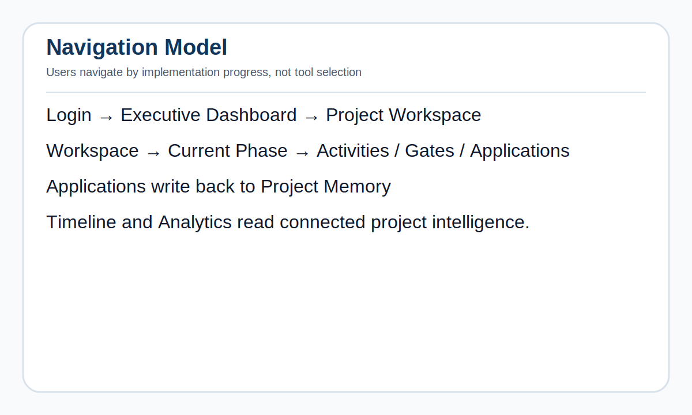

# 03 — Navigation Model PRS

## Document Control

| Field | Value |
|---|---|
| Product | OracleToolkit OS |
| Specification | Navigation Model |
| Version | v1.0 Pack 1 |
| Status | Approved Foundation |

## Executive Summary

OracleToolkit navigation must communicate that the product runs implementations. Users should navigate by project, lifecycle phase, activities, gate readiness, governance, and timeline — not primarily by tools.

Applications remain available but should not dominate the user experience.

## Navigation Philosophy

Every page should answer:

1. Where am I?
2. Which project am I working on?
3. Which implementation phase are we in?
4. What should happen next?
5. What is blocked?
6. Are we ready to move forward?
7. Which evidence supports the status?

## Navigation Diagram



Editable Mermaid source: [`diagrams/navigation.mmd`](diagrams/navigation.mmd)

## Primary Navigation

| Area | Purpose |
|---|---|
| Executive Dashboard | Health, readiness, risk, and go-live confidence |
| Workspace | Main project cockpit |
| Lifecycle | Phase engine and phase command centers |
| Applications | Compact launcher for optional applications |
| Timeline | Implementation audit history |
| Deliverables | Versioned outputs and artifacts |
| Governance | RAID, decisions, changes, dependencies |
| Analytics | Role-based insights |
| Settings | Project setup and administrative controls |

## Workspace Entry Model

After login, users should land in a project-aware experience.

Recommended Workspace sections:

1. Project Summary
2. Current Phase
3. Implementation Health
4. Next Required Activities
5. Open Risks / Blockers
6. Upcoming Gate
7. Recent Timeline
8. Recent Deliverables
9. Applications
10. Project Memory

## Applications Positioning

Applications are supporting tools. They should appear as compact launch tiles, not as the main product.

Current compact launcher principles:

- 4-column desktop layout
- 2-column tablet layout
- 1-column mobile layout
- Compact descriptions
- Consistent Launch behavior
- Project context inherited from Workspace

## Lifecycle-First Navigation Rules

1. Current phase must always be visible.
2. Project context must always be visible.
3. Applications must launch inside project context.
4. Deliverables must link back to phase and source.
5. Governance items must link to phase, owner, and status.
6. Timeline must be available from Workspace and phase views.
7. No application should require manual re-selection of project context when launched from Workspace.

## Breadcrumb Strategy

Suggested breadcrumb pattern:

```text
OracleToolkit > Workspace > Project Name > Lifecycle > Discovery > Gate Review
```

Application launch breadcrumb:

```text
OracleToolkit > Workspace > Project Name > Applications > BCEA Architect
```

## Empty States

Every empty state must explain the next action.

Examples:

- No deliverables: “Run an application or upload a deliverable to begin building project memory.”
- No phase activities: “Initialize lifecycle activities for this project.”
- No risks: “No active risks. Add risks manually or capture them during discovery.”
- No timeline: “Timeline events will appear as phases progress and deliverables are saved.”

## UX Principles

- Reduce cognitive load.
- Keep project context persistent.
- Prioritize phase progress over tool discovery.
- Use clear status chips.
- Use role-aware dashboard entry points.
- Do not expose implementation details such as URL bridges to the user.

## Acceptance Criteria

Navigation is successful when a new user can understand in under 10 seconds:

- Which project is active
- Which phase is current
- What applications are available
- What deliverables exist
- What requires attention next

## Revision History

| Version | Date | Notes |
|---|---|---|
| v1.0 Pack 1 | 2026-07-02 | Initial navigation model PRS |
